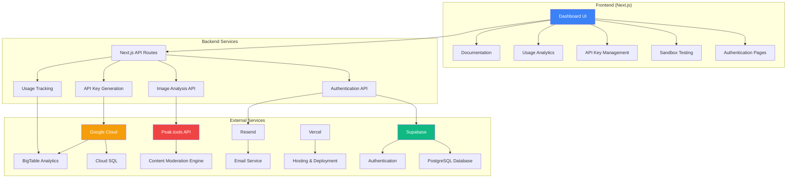
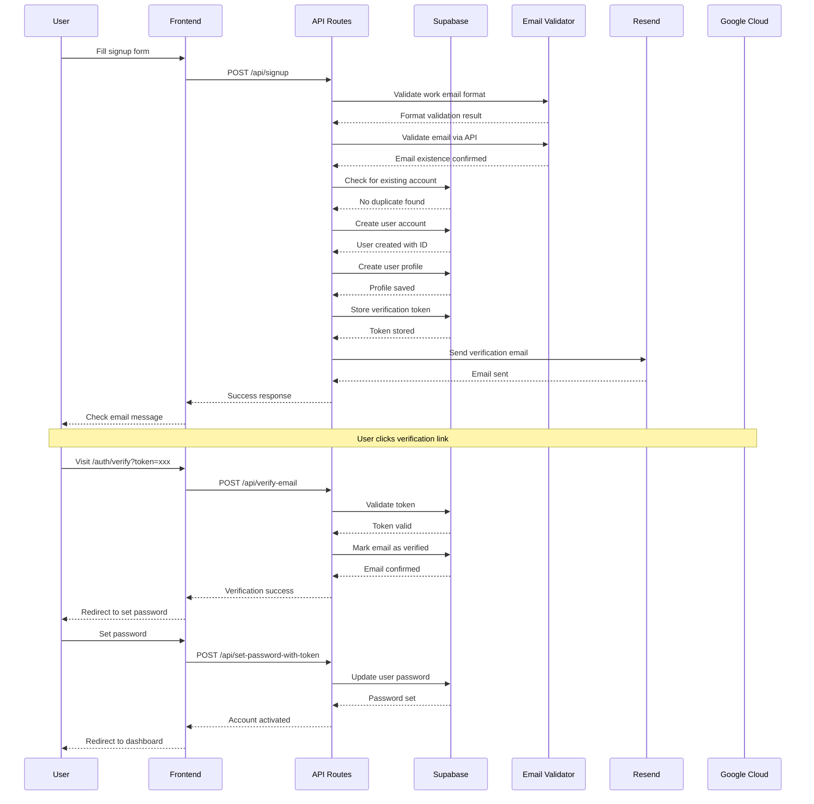
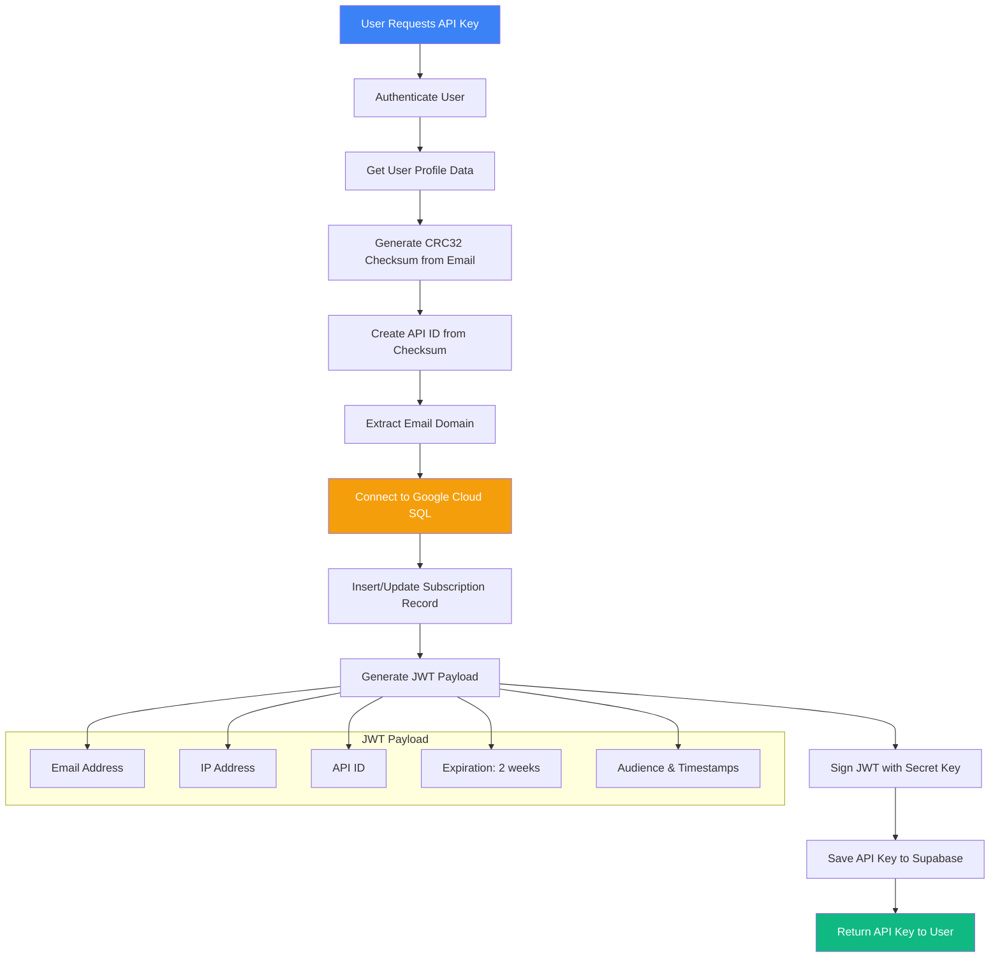
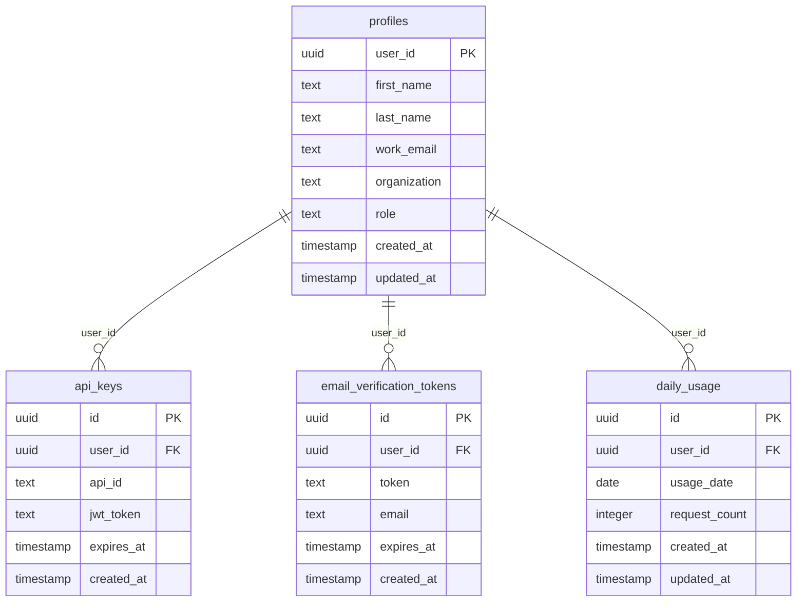
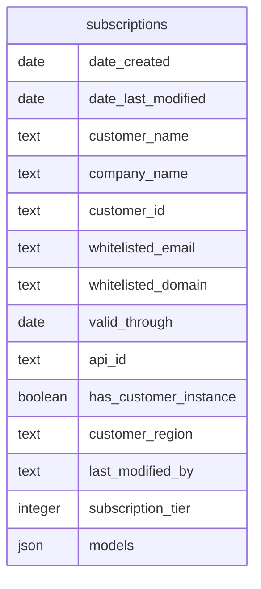

# Peak Content Moderation Platform

## Overview

Peak is a comprehensive content moderation platform that provides industry-leading CSAM (Child Sexual Abuse Material) and NSFW content detection APIs for images. The platform offers a user-friendly dashboard for testing APIs, managing API keys, and monitoring usage analytics.

### Key Features

- **Content Moderation APIs**: CSAM and NSFW detection with high accuracy
- **Interactive Sandbox**: Real-time image analysis testing interface
- **API Key Management**: Secure JWT-based authentication system
- **Usage Analytics**: Comprehensive tracking and reporting
- **Trial System**: 100 free requests per day with upgrade options
- **Professional Email Integration**: Work email validation and verification

## System Architecture



## Technology Stack

### Frontend
- **Next.js 15.3.4** - React framework with App Router
- **TypeScript** - Type safety and development experience
- **Tailwind CSS** - Utility-first styling
- **Framer Motion** - Animations and transitions
- **Lucide React** - Icon library
- **Recharts** - Data visualization

### Backend & Infrastructure
- **Supabase** - Authentication and primary database
- **Google Cloud SQL** - PostgreSQL for subscription data
- **Google BigTable** - Analytics and usage tracking
- **Peak.tools API** - External content moderation service
- **Resend** - Email delivery service
- **Vercel** - Hosting and deployment

### Authentication & Security
- **JWT Tokens** - API authentication
- **Row Level Security (RLS)** - Database access control
- **Work Email Validation** - Professional account verification
- **CRC32 Checksums** - API ID generation

## User Signup Experience



## Data Flow Architecture

```mermaid
graph LR
    subgraph "User Input"
        A[Image Upload] 
        B[Image URL]
    end
    
    subgraph "Dashboard Processing"
        C[Sandbox Interface] --> D[Input Validation]
        D --> E[Usage Limit Check]
        E --> F[API Key Retrieval]
    end
    
    subgraph "External API Integration"
        F --> G[Peak.tools API Call]
        G --> H[Content Analysis Engine]
        H --> I[CSAM Detection]
        H --> J[NSFW Detection]
        I --> K[Results Processing]
        J --> K
    end
    
    subgraph "Data Storage & Analytics"
        K --> L[Usage Increment]
        L --> M[Supabase Database]
        K --> N[BigTable Analytics]
        N --> O[Review Feed Data]
        M --> P[Usage Dashboard]
    end
    
    subgraph "User Experience"
        K --> Q[Results Display]
        P --> R[Usage Tracking]
        O --> S[Review Feed]
        Q --> T[Interactive Dashboard]
        R --> T
        S --> T
    end
    
    A --> C
    B --> C
    
    style H fill:#ef4444,color:#fff
    style M fill:#10b981,color:#fff
    style N fill:#f59e0b,color:#fff
    style T fill:#3b82f6,color:#fff
```



## API Key Generation Flow



## Database Schema

### Supabase Tables



### Google Cloud SQL Tables



## Core Application Features

### 1. Sandbox Testing Environment
- **Real-time Image Analysis**: Upload files or provide URLs for instant content moderation
- **Multiple Detection Models**: CSAM, NSFW, or both simultaneously
- **Results Visualization**: Clear confidence scores and predictions
- **Usage Monitoring**: Real-time usage indicators and limit tracking

### 2. API Key Management
- **Secure Generation**: CRC32-based API IDs with JWT authentication
- **Automatic Expiration**: 2-week token lifecycle with renewal options
- **Usage Tracking**: Per-key analytics and monitoring
- **Integration Ready**: Copy-paste API credentials for external use

### 3. Usage Analytics & Monitoring
- **Daily Limits**: 100 free requests per day for trial users
- **BigTable Integration**: Comprehensive analytics and request logging
- **Review Feed**: Historical analysis results and performance tracking
- **Real-time Updates**: Instant usage counter updates via cache invalidation

### 4. Account Management
- **Work Email Validation**: API-based email verification for business accounts
- **Profile Management**: Organization and role tracking
- **Password Management**: Secure password reset and update flows
- **Trial Status**: Upgrade prompts and limitation notifications

## API Integration

### Content Moderation Endpoint
```
PUT https://api.peak.tools/sentry
```

**Headers Required:**
- `api-id`: Your unique API identifier
- `Authorization`: Bearer JWT token
- `x-from-gui`: "True" (for dashboard requests)

**Supported Formats:**
- **File Upload**: `multipart/form-data` with image file
- **URL Analysis**: `application/json` with `target_url`

**Models Available:**
- `csam`: Child Sexual Abuse Material detection
- `nsfw`: Not Safe For Work content detection
- `csam,nsfw`: Both models simultaneously

### Response Format
```json
{
  "url": "https://example.com/image.jpg",
  "results": [
    {
      "model": "csam",
      "prediction": "safe"
    },
    {
      "model": "nsfw", 
      "prediction": "nsfw"
    }
  ]
}
```

## Email System Integration

### Work Email Validation
- **Format Validation**: Regex-based professional email format checking
- **API Validation**: External service verification for email existence
- **Domain Filtering**: Business domain requirements (no generic providers)

### Email Flows
- **Verification**: Welcome email with account activation link
- **Password Reset**: Secure token-based password recovery
- **Resend Options**: Re-trigger verification emails as needed

## Development Setup

### Prerequisites
- Node.js 18+ and npm
- Supabase account and project
- Google Cloud Platform account
- Resend account for email delivery

### Environment Variables
```bash
# Supabase Configuration
NEXT_PUBLIC_SUPABASE_URL=your_supabase_url
NEXT_PUBLIC_SUPABASE_ANON_KEY=your_anon_key
SUPABASE_SERVICE_ROLE_KEY=your_service_role_key

# Google Cloud Configuration  
GCP_SERVICE_ACCOUNT_JSON=your_service_account_json
GCP_DB_INSTANCE_CONNECTION_NAME=your_instance_connection

# API Configuration
SECRET_KEY=your_jwt_secret
AUDIENCE=your_jwt_audience

# Email Configuration
RESEND_API_KEY=your_resend_api_key
```

### Installation & Running
```bash
# Install dependencies
npm install

# Run development server
npm run dev

# Build for production
npm run build

# Start production server
npm start
```

### Database Setup
1. **Supabase**: Create tables for profiles, api_keys, daily_usage, email_verification_tokens
2. **Google Cloud SQL**: Set up subscriptions table for API key management
3. **BigTable**: Configure analytics tables for usage tracking

## Deployment

### Vercel Configuration
The application is optimized for Vercel deployment with:
- **Build Command**: `npm run build`
- **Framework**: Next.js automatic detection
- **Region**: `iad1` (US East)
- **Environment**: Production, preview, and development configurations

### Security Considerations
- **Row Level Security**: Supabase RLS policies ensure user data isolation
- **JWT Validation**: All API routes verify user authentication
- **Rate Limiting**: Daily usage limits prevent abuse
- **Input Sanitization**: File uploads and URLs are validated and sanitized

## Monitoring & Analytics

### Usage Tracking
- **Real-time Counters**: Immediate usage updates via Supabase functions
- **Daily Aggregation**: Per-user request counting and limit enforcement
- **BigTable Analytics**: Comprehensive request logging and analysis
- **Cache Management**: Strategic invalidation for real-time dashboard updates

### Performance Optimization
- **Image Processing**: Efficient file handling and multipart uploads
- **Database Queries**: Optimized with proper indexing and RLS
- **Client-side Caching**: Strategic use of React state and browser storage
- **API Response Caching**: Smart cache invalidation strategies

---

## Support & Contact

For technical support, API questions, or account issues, please contact the Peak team through the dashboard or visit our documentation portal.

**Dashboard**: [Your Dashboard URL]  
**API Documentation**: Available in the dashboard documentation section  
**Status Page**: Monitor service availability and performance
